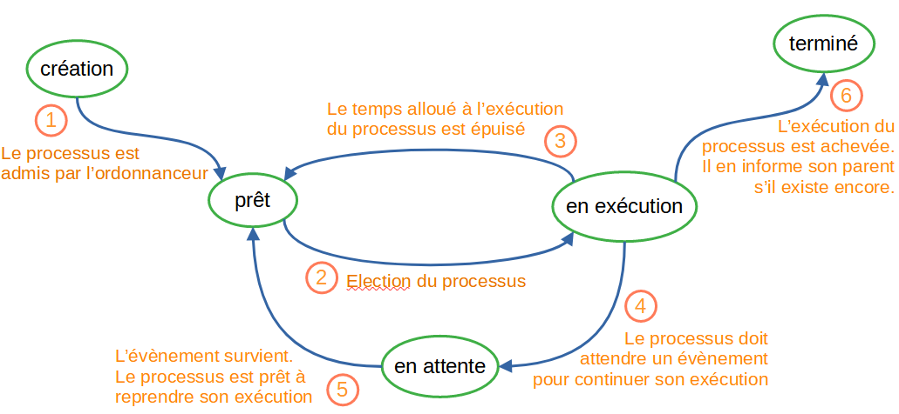

Matthieu FARANDJIS
INF3-FI

# Programmation Avancée - Rapport TP1 et TP2 fusionné

**Remarques :** 
Les explications données viennet de ce que j'ai compris des TP, du cours et de ressources trouvable sur internet. 
J'ai brièvement utilisé ChatGPT, il me semble sur la distinction entre mémoire partagée et mémoire distribuée, uniquement pour être sur de ce que j'écrivais. 
J'ai également utilisé le site languagetool pour corriger les fautes d'orthographe et deepl pour m'aider à traduire certains textes qui étaient en anglais. 
  

### Rappel définitions :  
**Association :** relation entre deux classes 
**MUTEX :** Mutual Exclusion 
**Sémaphore :** Système de verrou permettant d'asurer qu’un objet ne subisse pas en même temps plusieurs séquences
d’actions. 
**Thread (processeur) :** Processus lourd qui porte des processus léger 
**Section critique :** Portion de code dans laquelle ne s’exécute qu’un thread à la fois. Une section critique est utilisée lorsque plusieurs thread accède à une même  ressource. 
**BlockingQueue :** Cette interface est une extension de l'interface Queue<E>. L'interface Queue<E> permet de modéliser une file d'attente, de taille éventuellement fixée, et qui ne peut pas être modifiée. On peut ajouter, retirer un élément, ou examiner le suivant sans le retirer. 
**Méthode de BQ, Poll :** La méthode poll de l'interface BlockingQueue renvoie la tête de BlockingQueue en supprimant cet élément. Si la file d'attente est vide, la méthode poll() attendra jusqu'à un certain temps qu'un élément devienne disponible. 
**Méthode de BQ, Offer :** La méthode offer de BlockingQueue insère l'élément passé en paramètre à la queue de cette BlockingQueue si la file d'attente n'est pas pleine. Si la file d'attente est pleine, elle attendra un certain temps avant que de l'espace se libère. 
**Thread.currentThread() :** Le thread principal est créé automatiquement lors du démarrage de notre programme. Cette méthode renvoie une référence au thread sur lequel elle est appelée.  
**Mémoire partagée :** (de manière résumée) Tous les cœurs de processeur peuvent accéder à la même mémoire. Exemple (je pense) : un serveur 
**Mémoire distribuée :** (de manière résumée) La mémoire est formée par plusieurs ordinateurs connectés entre eux. Exemple : Le Cluster de Rpi, Les 4 Pi0 forment à elle seul une seule machine.  

  
### Liens intéressants :
**Sur l'API Concurrent (TP2 Boulangerie BAL) :** https://blog.paumard.org/cours/java-api/chap05-concurrent-queues.html 
**Autre cours processus thread :** http://lycee.stanislas.info.free.fr/Interne/Processus/Processus.html 

## 0 - TD0 : Etude de notre ordinateur

Avant de commencer un projet, il peut être utile de connaître notre architecture matérielle. 
C'est à dire voir les informations du système et voir quel est notre processeur, sa fréquence, si c'est un 64 ou 32bits, son nombre de coeurs, de thread et la taille de son cache. 
Mais également connaître sa quantité de ram, son système d'exploitation et d'autres informations pouvant impacter l'utilisation de notre programme. 
 
Après cette première recherche, on fait une recherche sur internet pour récupérer la documentation et mieux apprendre quels sont les composants. 
  
Il est important de savoir sur quel système nous créons notre logiciel pour dire quelle est la configuration nécessaire pour l'utiliser. 
Par exemple dans le cas de la mémoire RAM, en G25 les ordinateurs ont 8Go de RAM alors qu'en I21 ils en ont 16. 
Si notre programme est conçu pour fonctionner avec 16Go de ram, il est possible qu'il s'exécute mal sur les PC de la salle G25. 
Si nous voulons malgré tout l'utiliser, on va devoir distribuer la mémoire entre deux ordinateurs de la salle G25, puisque dans l'idée 2x8 = 16. 
  
Dans la même idée, un programme conçu pour fonctionner avec un processeur monocoeur peut disfonctionner avec un processeur multicoeur, si le logiciel n'est pas conçu pour gérer une telle architecture. 

## I - Les threads

### TP1 Partie 1 : Le mobile et son thread

La première étape du TP1 était de créer un carré mobile se déplaçant de gauche à droite puis de droite à gauche en boucle. 
Puisque l'on ne doit avoir qu'un seul mobile, on ne peut pas concevoir un thread par mobile (puisqu'il y en a qu'un). 
De plus, l'idée de 2 threads pour un seul mobile ou l'idée d'alterner entre les deux (alterner entre tuer A puis B et créer B puis A) n'ont pas de sens. Dans ces deux cas, on aurait alors plusieurs mobiles 
Une autre idée serait de tuer le premier thread pour associer le mobile à un autre thread pour qu'il se déplace, mais dans ce cas, on 'a plus un seul mobile.

La solution était donc de créer un seul thread pour tous les mobiles. 

La tâche du mobile est d'aller de gauche à droite, donc on modifie run si on veut faire de droite à gauche afin qu'on n'ait qu'un seul thread pour un seul mobile. 
Ainsi, lorsque l'on fait leThread.start -> on le met à l'exécution 
Pour les prochaines fois, le système s'en occupe, mais on a la possibilité de s'en occuper nous même.

### TP1 Partie 2 : Le bouton pause
Je n'ai pas réussi cette partie du TP, seulement pour comprendre ce que le bouton devait faire, on doit comprendre les étapes de vie d'un processus. 
 
La création du thread créera un processus qui sera mis en état "prêt" par l'ordonnanceur. Il le mettra à l'état "en exécution" lorsqu'il sera pris en charge. 
Lorsqu'il est pris en charge, le mobile se déplace. 
Lorsque l'on clique sur "Pause, on met en pause le thread et notre processus passe à l'état "en attente". On le garde en mémoire, mais il ne fait rien, on ne s'en occupe pas. 
Lorsque l'on clique sur "Reprendre", le thread reprend et le processus repasse à l'état "prête" avant de repasser dès que possible à l'état "en exécution". 
 

 
*Source image : stephane_ramstein.gitlab.io*

### TP1 Partie 3 : Les mobiles

Lors de la création de la fenêtre, plutôt que de créer 1 seul mobile, on peut en créer plusieurs dans un datagridview (afin qu'ils soient l'un au dessus de l'autre). 
Pour chacun, on leur crée un thread que l'on leur associe avec des paramètres différents comme la vitesse. 
Chaque mobile avance indépendamment l'un des autres, vu qu'ils ont leur propre thread et leur propre objet mobile.

### TP1 : Représentation UML

## II - Les sémaphores
### Introduction : Comment se problème pourrait se présenter dans la vie courrante
Le TP2, au premier démarrage, se comporte comme ce que pourrait faire une imprimante si elle devait traiter en même temps deux documents. 
Le risque est de faire un mélange des deux documents. Un autre problème est que l'exécution des threads n'est pas ordonnée, ils s'exécutent dans un ordre aléatoire. 

### TP2 Premier démarrage : Sans sémaphore
Lorsque nous démarrons le programme, les mots "AAA" et "BB" se mélanget à l'affichage de manière aléatoire. On remarque davantage l'effet si on rajoute le mot "CCCC". 
 
Exemple, lancement 1 : BCAACBACC 
Lancement 2 : BCABCACAC 
 
Nous pouvons supposer que les threads fonctionnent en simultané, il n'y a pas de synchronisation donc chacun essaye d'afficher en même temps chacun de ses caractères. 
Pour résoudre ce problème, le programme doit ordonner les 3 threads : en premier le A, puis le B, puis le C. 
 
Les threads cherchent donc à accéder en même temps à la sortie d'affichage : l'objet out de la classe utilitaire System. 
System.out est la ressource critique. 
Plus particulièrement, la section critique est la boucle for de la classe Affichage. 
  

### TP2 Résolution 1 du problème (synchronised)

Pour résoudre ce problème, nous pouvons utiliser la fonction Java synchronise. 
 
Seulement, le lancement des threads ne sont pas ordonnés. 

  

### TP2 Résolution 2 du problème (sémaphores)
Le sémaphore utilise une variable "valeur", si c'est 0 : il bloque, si c'est 1 : il ne fait rien.
Lorsque l'on fait syncWait via SemaphoreBinaire, il passe "valeur" à 0 et Semaphore fait wait.

On crée l'objet dans l'objet Main que l'on transmet à chaque thread lors de leur création. 
Chaque thread possède le même sémaphore. 
Lorsque le premier thread s'exécute, il active le sémaphore en faisant syncWait ce qui bloque les autres. 
Lorsqu'il termine, il libère le sémaphore en faisant un syncSignal(). 
En cela, un nouveau thread peut prendre la main (donc après avoir totalement terminé d'exécuter l'ancien thread). 
  

### TP1 Partie 4 : Les mobiles et le sémaphore

Dans cette partie, on découpe l'écran en trois : 
**De 0/3 à 1/3 ->** les mobiles avancent 
**De 1/3 à 2/3 ->** Un premier mobile entre dans la zone, prend la main (et devient rouge), les autres mobilent doivent attendre avant d'entrée. 
**De 2/3 à 3/3 ->** Le mobile libère le verrou, tous les autres reprennent leur marche, le deuxième à passer reprend la main. 
Puis, on recommence ce même cycle, mais dans l'autre sens :  depuis la droite cette fois. 

 
Nous remarquons que tous les mobiles atteignent la position 1/3, mais seulement quelques uns vont se déplacer durant l'exécution du programme. 
Certains mobiles peuvent se déplacer durant un moment, puis s'arrêter pour toujours et d'autres inversement. 
On remarque également que ces quelques mobiles sont quasiment continuellement en mouvement. Seulement, un seul mobile ne circule entre 1/3 et 2/3. 
 

Pour comprendre la situation, on peut représenter `sem.syncWait();` comme une porte.
Lorsque le premier mobile atteint cette porte, elle est ouverte. Il la ferme en entrant, les prochains mobiles, qui forment une queue, se trouvent bloqués derrière. 
Lorsqu'il atteint la sortie `sem.syncSignal();`, il rouvre la porte, le deuxième mobile passe. 
Le premier continue son chemin, il ne se trouve devant aucune porte, on se retrouve avec plusieurs mobile simultanément en mouvement. 
 
Le fait qu'il y ai 2 portes fait que les mobiles bloqués en venant de la droite se retrouvet au tout devant de la file. 
De ce fait, les mobiles plus éloignés ne passeront jamais. Le résultat dépend de la puissance de l'ordinateur. 

## III - API Concurrent
L'API Concurrent est conçue pour gérer des demandes simultanées provenant de processus, afin de faire de l'exécution parallèle. 

### TP3 : La Boîte Aux Lettres (BAL) et l'API Concurrent avec BlockingQueue
Rappel de l'ennoncé du TP : Nous avons un ou plusieurs postiers, et un ou plusieurs destinataire utilisant une même boîte aux lettreS qui est limitée à 20 lettres. 
Chaque personne est représenté par un thread ou chacun exerce une même action en fonction de son rôle (place une lettre si possible pour le postier, récupère une lettre si possible pour le client). 
 
Pour cela, nous avons utilisé la classe BlockingQueue de l'API Concurrent qui est dédié pour gérer ce genre de cas. 
 
Nous pouvons également utiliser les sémaphores. 
Ici, la section se trouve lorsque le client ou le postier interagi avec la boîte aux lettres puis nous informe de ce qu'il en est. 
Le risque est qu'entre le moment où le postier poste et nous informe, un client récupère la lettre. 
Dans ce scénario, le client récupère la lettre n°X avant que le postier annonce son dépôt. De ce fait, on pourrait croire que c'est une deuxième lettre n°X.
Problème, à la réception ce sera la lettre n°E... 
Le sémaphore permet de laisser le temps à chacun de terminer son action. Cela me fait penser aux transactions en SQL afin d'empêcher l'incohérence de données lorsque deux utilisateurs manipulent une base de données. 

### TP3 : Représentation UML

## IV - Lien que l'on pourrait faire avec la SAÉ (le 25/10/2024)
Notre SAE se porte sur les calculs parallèles et distribués, c'est à dire des calculs qui seront calculés sur 4 RaspberryPi 0. 
On peut tout de suite imaginer l'utilisation de thread et de sémaphore. 
 
Les informations tirées viennent du rapport d'installation du système de la SAE (2-fonctionnement_calculs_paralleles_distribues.md). 
Cette partie n'est qu'un résumé. 

### MPI
MPI (Message Passing Interface) est une bibliothèque avec un ensemble de fonctions standardisées pour les architectures à mémoire distribuée. 
MPI permet d'exploiter plusieurs nœuds de calcul reliés par un réseau de communication. 
L'objectif est de tirer parti de la présence de plusieurs cœurs de processeurs. 
  
Il existe une commande mpirun qui permet à l'aide de ses options de répartir l'exécution d'un programme sur plusieurs machines et de leur attribuer un nombre de processus chacun. 
Plus un RPi possède de processus dédiés au programme, plus celui-ci calculera au détriment des autres. 
Nous avons testé cette commande sur un script Python calculant les X premiers nombres premiers. 
 
Ce ne sont que des suppositions, **les explications données n'ont pas été vérifiées et peuvent être fausses** :
mpirun divise le processus initial du programme en plusieurs threads répartis sur chacune des machines. 
Il n'y a pas vraiment de sémaphore : on n'a pas besoin de protéger une ressource en particulier, seulement, un processus ne peut utiliser un autre que quand il est disponible. 

### Le cluster
Notre cluster de RaspberryPi suit l'architecture à mémoire distribuée. Chaque Raspberry Pi dispose de sa propre mémoire (RAM) et la partage avec les autres Pi0 à l'aide du clusterhat. 

### Comment ce cours peut nous aider
Notre cours de Programmation Avancée nous permet de mieux comprendre le fonctionnement de notre cluster. 
Par ailleurs, pour que notre programme gagne en efficacité, il est tout à fait plausible qu'on devra créer et répartir nous mêmes certains threads sur les RPi et utiliser des sémaphores. 
On pourra ainsi étudier les différences de performance et utiliser les atouts du cluster. 

